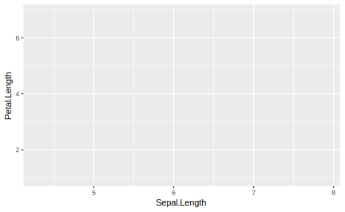
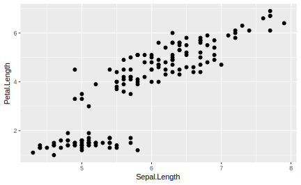
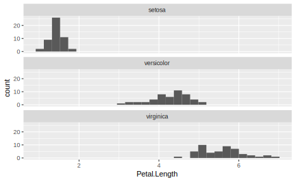
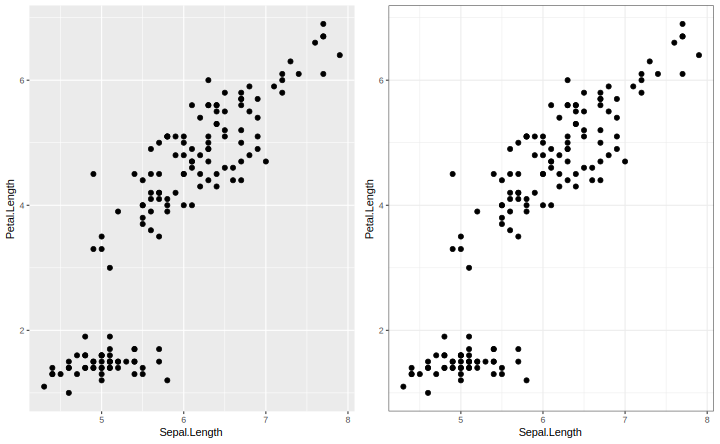
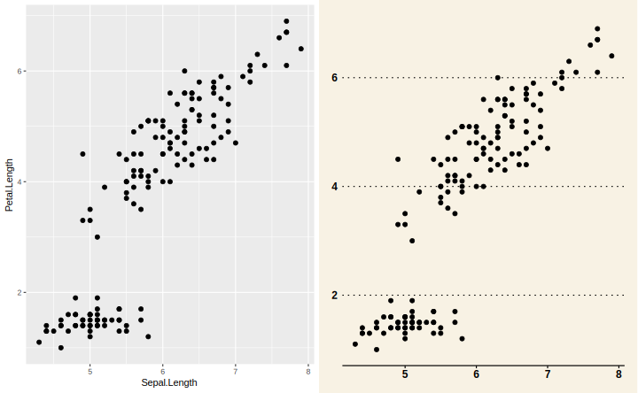
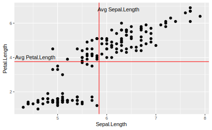

# Data Visualizations {#dataviz}

Good marketing tells a story, it evokes an emotion, and elicits a response. The same 
can be said about good data visualizations. In this chapter we will show you how 
to use the R package **ggplot2** to visualize different types of marketing data to 
tell your story.

## Creating a Canvas

<div style="clear:left;overflow: auto;">
  
  The **ggplot2** package is an interesting solution because it does not provide a set of 
  chart types that you can pick and choose. Microsoft Excel has always provided a 
  fixed set of scattercharts, bar charts, and other popular visualizations. 
  In contrast, ggplot2 an extensible system of commands that build literally any 
  picture you'd like to create. Talented R users have created ggplot masterpieces, 
  such as, Garrett Grolemund and David Kahle's plot of Hadley Wickham. 
  
  Every ggplot visualization starts with a canvas. You can create a blank canvas using the 
  function `ggplot()`. This function takes two arguments: 1) `data` and 2) `mapping`. 
  You can think of the `data` argument as a pallete of information from which to construct 
  the plot and and the `mapping` as the plan for how to structure that information (e.g. 
  as the x-axis, y-axis, size, shape or color). Supplying these argument still stop 
  short of actually creating a plot
</div>


```r
library(tidyverse)
#library(completejourney)
ggplot(data=iris, mapping=aes(x=Sepal.Length, y=Petal.Length))
```



## Adding Layers of Geoms

Now that you've created a blank canvas, you need to add layers to it. In the canvas 
example above we used the `aes()` function, which is short for aesthetics. When 
you define the aesthetics in the top level `ggplot()` function call, it applies 
those aesthetics to every layer that subsequently gets applied to the plot. Layering 
is the core idea of constructing a plot. Every new layer gets added to the canvas 
via the plus sign (`+`). As an example, let's add a set of points to the canvas. 
You can do this using the `geom_point()` function. 


```r
ggplot(data=iris, mapping=aes(x=Sepal.Length, y=Petal.Length)) +
  geom_point()
```



In the code above the `ggplot()` function creates a canvas with the direction to 
register the `iris` dataset for potential plotting values and to orient the axes 
so that the x-axis represents the `Sepal.Length` variable and the y-axis represents 
the `Petal.Length`. This is quite a bit of direction, but the `ggplot()` function 
is just creating this canvas. Given all that upfront direction you can add the 
`geom_point()` function with no arguments. The function can already infer that 
you would like points from the `iris` dataset based on the `Sepal.Length` and the 
`Petal.Length`. The alternative is to specify that aesthetic mapping within the 
`geom_point()` function like so: 


```r
ggplot(data=iris) +
  geom_point(mapping=aes(x=Sepal.Length, y=Petal.Length))
```


This block of code creates the same exact plot as the first, but in this example 
is much more obvious that you would like to arrange the points with the x and y-axes 
as specified. Before talking more about the syntax of the **ggplot2** package, 
it is important to clarify that a "geom" is shorthand for adding a layer to your 
plot of a specific geometric shape. Geoms are the heart of the plot because they 
define whether the plot is a line plot, scatterplot, or bar plot. In each of these 
examples, the geom would be `geom_line()`, `geom_point()` or `geom_bar()` and there 
are many more geom types to consider. The **ggplot2** package tries to makes things 
intuitive and easy to remember. However, if you need a list of all the geoms you can 
find them using tab completion in RStudio. Just type `geom_` in your RStudio "Console"
window, then press `TAB`. This will trigger the tab-completion feature in RStudio 
and show you the list of geoms that are available for you to use. 


Typically, a plot only contains one type of geom. For example, a plot using `geom_bar()` 
creates a bar plot, but the layering principle makes it simple to a compound plot 
with more than one geom so that you can have, for example, bars and a line in the 
same plot.


```r
# CREATE A COMPOUND PLOT WITH A BAR AND A LINE ACROSS
```

## Adding Labels, Axes, and Legends

With plots it is important to pay attention to the details. These details make an 
effective plot and just like Microsoft Excel allows you to add and customize each 
element, so does ggplot. The trick is knowing which functions to use so in this 
section we will introduce lists of the most common and then present all of them 
together to demonstrate how to create a single polished plot. 

First, when creating axes you will reference them using one of the functions 
starting with "`scale_`". You must know the datatype being represented on the axis 
in order to pick the right function. For example, if you are plotting integers or 
numeric values on the x-axis then use the function `scale_x_continuous()`. If you 
are plotting characters or factors, then use `scale_x_discrete()` and if you are 
plotting a date or datetime, then use `scale_x_date()`. Specifying these functions 
will allow you to pass in explicit breaks, axis labels formatting, and more. In the 
example below we have forced the scale from 0 to 8 to with break at every 2 units
and showing one decimal place.


```r
# COME UP WITH A BETTER EXAMPLE THAN WHAT IS DESCRIBED ABOVE!
```

We highly recommend using the **scales** package when plotting. It comes with a variety 
of functions to make the scale of axes easier to read. For example, if you would like 
to display the axes with percent signs and have there be 5 break points, then you 
can specify like so: 


```r
# scales::percent, breaks=pretty_breaks(5)
```

After configuring the axes, you should label them along with titling the plot. The 
`labs()` function accepts the arguments `title`, `subtitle`, `caption`, `x`, `y`, 
`fill`, `color`, and more. The purpose of the `labs()` function is to be a generic 
function that allows you to provide labels for most all parts of the plot from the 
aesthetics, to axes, or the overall plot itself.


```r
#labs() code here
```

## Faceting Data by Group

A common research question is comparing a data across groups. The best way to 
visualize these relationships is to use the `facet_wrap()` function. A facet 
creates a panel of plots with one for each value in the grouping variable. In the 
example below we have created a `Petal.Length` histogram for each `Species` in the 
iris dataset.


```r
#REPLACE WITH A MARKETING DATA EXAMPLE
ggplot(data=iris) + 
  geom_histogram(mapping=aes(x=Petal.Length)) + 
  facet_wrap(.~Species, ncol=1, scales="fixed")
#> `stat_bin()` using `bins = 30`. Pick better value with `binwidth`.
```



This shows, very distinctly, how the distribution of `Petal.Length` differs for 
each of the species. One important aspect to remember when creating facet charts 
is the scale of the axes in each panel. You can accidentally, and purposefully, 
mislead readers by having the same metric plotted on two different axis scales. 
The default argument is `scales="fixed"` meaning that the x and y-axes are the 
same for every panel. You can change that so each panel has a different scale for 
either axis or both.

Note that the syntax for facetting plots has changed over time, from formula notation 
to a newer style. There is even a new function called `facet_grid()` which has the 
same behavior. You may see examples online that use this older notation like so 
`facet_wrap(.~var)`, but this is equivalent to `facet_grid(cols=vars(var))`.

## Chart Types

*****
WHAT SORT OF CHARTS SHOULD BE HIGHLIGHTED HERE????  
Marketing Specific Charts?  
Pie chart? a critique on pie charts  

*****

## Advanced Plotting

The **ggplot2** package provides access to the general look and feel of the plot 
via a "theme". You may notice in that most plots have a grey background with minor 
and major axis lines. This is because the default theme is `theme_gray()`. You can 
have complete control over every aspect of the plot's look by using the `theme()` 
function; however, there are a number of pre-configured themes to choose from. A 
good example is the `theme_bw()` function. Adding this at the end of any plot will 
make the background white. 


```r
library(gridExtra)
plot1 <- ggplot(data=iris, mapping=aes(x=Sepal.Length, y=Petal.Length)) + geom_point()
plot2 <- ggplot(data=iris, mapping=aes(x=Sepal.Length, y=Petal.Length)) + geom_point() + theme_bw()
grid.arrange(plot1, plot2, ncol=2)
```



A complete list of default **ggplot2** themes is available in the documentation at 
https://ggplot2.tidyverse.org/reference/ggtheme.html. These are just the options 
that come with the **ggplot2* package, but there are over 20 themes available via 
the **ggthemes** package. This includes styling that match some of the most prolific 
writers of data journalism including, The Economist, Five Thirty Eight, The Wall 
Street Journal and more. Despite the overwhelming number of options, we recommend 
using `theme_bw()` for the best formatting using only the **ggplot2** package. 


```r
library(ggthemes)
plot1 <- ggplot(data=iris, mapping=aes(x=Sepal.Length, y=Petal.Length)) + geom_point()
plot2 <- ggplot(data=iris, mapping=aes(x=Sepal.Length, y=Petal.Length)) + geom_point() + theme_wsj()
grid.arrange(plot1, plot2, ncol=2)
```



Even with the right plot type, readers might need an extra callout or highlight to 
the core insight. In keeping with the idea of layers, you can annotate a plot with 
a line, text, or other shape just by adding it as another layer. For example, there 
are geoms available for you to add a horizontal line (`geom_hline()`) or vertical 
line (`geom_vline()`). The `annotate()` function makes it easy to add text or shapes.


```r
ggplot(data=iris, mapping=aes(x=Sepal.Length, y=Petal.Length)) + 
  geom_point() + 
  geom_hline(yintercept=mean(iris$Petal.Length), color="red") +
  geom_vline(xintercept=mean(iris$Sepal.Length), color="red") + 
  annotate(geom="text", label="Avg Petal.Length", 
           x=min(iris$Sepal.Length) + 0.25, 
           y=mean(iris$Petal.Length) + 0.25) + 
  annotate(geom="text", label="Avg Sepal.Length", 
           x=mean(iris$Sepal.Length) + 0.4, 
           y=max(iris$Petal.Length) - 0.1)
```



We would be remiss not to mention the amazing collection of open source "extensions" 
that make it easier to produce beautiful plots. There are dozens of packages registered 
as extenders of the **ggplot2** package. These packages make it easy for users to 
create complex plots. For example, the **gganimate** package makes it possible to 
animate plots typically to exhibit trends as they evolve over time. The package 
**ggrepel** uses a dynamic algorithm to label all points in a scatterplot without 
having overlapping labels. It is truly amazing work that is being done by researchers 
and analysts who contribute their work back to the R user community. {This type of 
collaboration is why using an open-source software can be a good decision.} say this??


```r
# EXAMPLE OF A USEFUL EXTENSION, POSSIBLY MARKETING RELATED?
```


*****
SHOULD WE TALK ABOUT DATA FORMAT (I.E. LONG VS WIDE)??? - gather?  

*****
